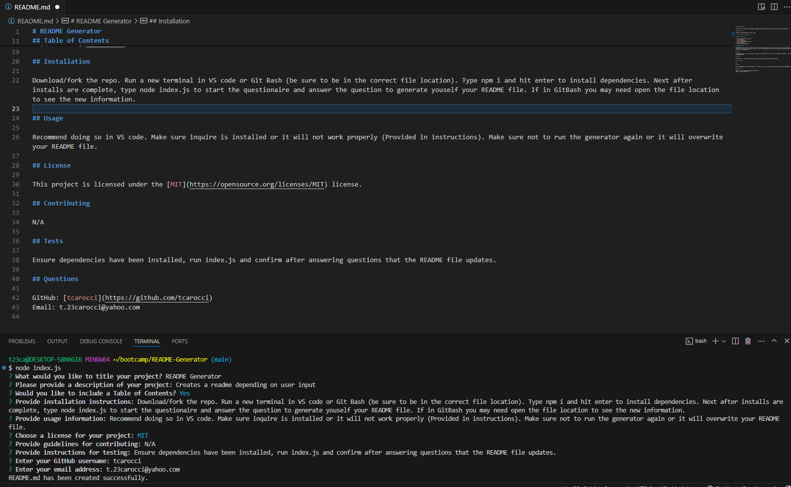

# README Generator

## Description

Creates a readme depending on user input.

[Link to Video Demonstration](https://app.screencastify.com/v3/watch/9nUvICBsXLYsWcuTALsS)

## Table of Contents

- [Installation](#installation)
- [Usage](#usage)
  [License](#license)
- [Contributing](#contributing)
- [Tests](#tests)
- [Questions](#questions)

## Installation

This is for using Git Bash. If needing instructions for VS code, let me know and I can create a video as well!

Step 1. Download/fork the repo from my Github site.

Step 2.Run a new terminal in Git Bash and put yourself into a folder of your chosing by usimg ls (to see your fodlers) and cd to change directory (moves you into the desired folder).

Step 3. When inside the location of your chosing. Type in git clone then paste the forked repo (see video for better understanding). Use cd to get to the copied location. Ensure to cd into the the README-Generator folder before continuing below (highlighted in video).

Step 4. Type npm i and hit enter to install dependencies.

Step 5. Next after installs are complete, type node index.js and hit enter to start the questionaire and answer the prompted questions to generate youself your README file.

Step 6. Find your folder/file to confirm the readme has been created.

## Usage

Recommend doing so in VS code. Make sure inquire is installed or it will not work properly (Provided in instructions). Make sure not to run the generator again or it will overwrite your README file.

## License

This project is licensed under the [MIT](https://opensource.org/licenses/MIT) license.

## Contributing

Me, myself, and I.

## Tests

Ensure dependencies have been installed, run index.js and confirm after answering questions that the README file updates.

## Questions

GitHub: [tcarocci](https://github.com/tcarocci)
Email: t.23carocci@yahoo.com

Example:

